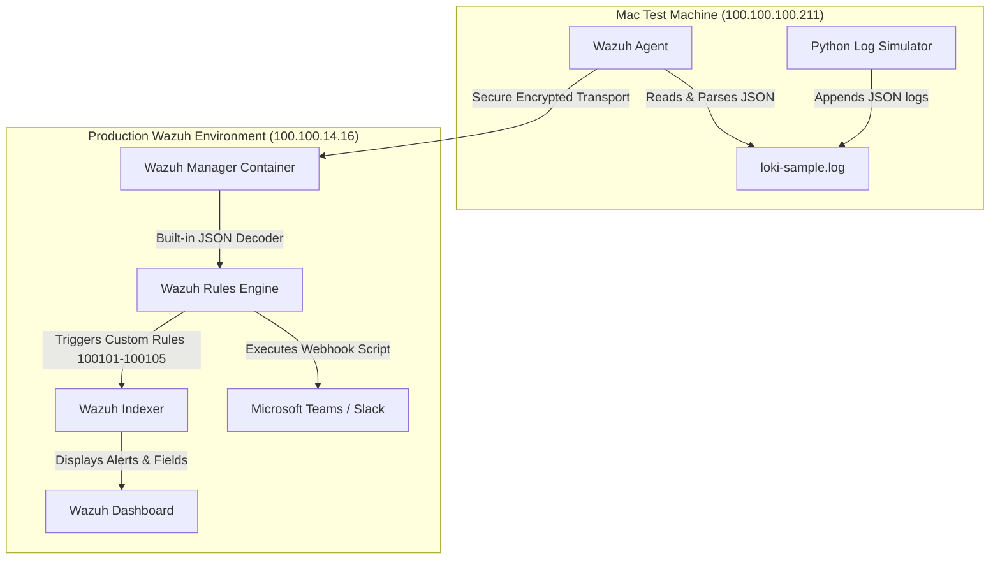

# Wazuh + Loki Integration: SIEM and Observability POC for JSON Logs

This repository contains the architecture, log generator, and configuration templates for a Proof of Concept (POC) evaluating **Wazuh** as both a Security Information and Event Management (SIEM) system and a structured observability platform (acting as a Grafana Loki alternative) for JSON application and network logs.

---

## 1. Project Architecture

This POC demonstrates how structured JSON logs generated by application containers and network devices can be collected, decoded, indexed, and alerted upon without deploying Grafana Loki or modifying your core production infrastructure.



---

## 2. Repository Components

* **`loki-simulator/`**: The log generation engine.
  * `scripts/loki_sample_generator.py`: Generates structured JSON events simulating container apps (`grafana-loki`) and network gateways (`router-gateway`).
* **`wazuh-configs/`**: Wazuh configuration snippets.
  * `agent-ossec-snippet.conf`: Configuration snippet for `/Library/Ossec/etc/ossec.conf` to parse the logs as JSON.
  * `manager-local-rules.xml`: Custom Wazuh rules to decode logs and trigger high-severity alerts.
  * `custom-teams.py`: A Python script for custom Microsoft Teams webhook integrations.

---

## 3. Log JSON Schema

The generator writes flat JSON structures containing the following fields:

```json
{
  "timestamp": "2026-07-19T06:49:42.432189Z",
  "level": "CRITICAL",
  "app": "router-gateway",
  "hostname": "router-core-01.prod",
  "device_name": "router-core-01.prod",
  "source_ip": "10.0.1.1",
  "unique_id": "LOKI_ROUTER_router-core-01.prod_00001",
  "tenant": "production",
  "device_type": "router",
  "message": "High CPU utilization (95%) detected on Route Processor"
}
```

* **`hostname` / `device_name`**: The origin name of the container or router device. `device_name` is used specifically in Wazuh rule descriptions to prevent system conflicts with the Wazuh Agent header.
* **`source_ip`**: The IP address of the origin device.
* **`app`**: The application/service name.
* **`message`**: The human-readable event message.

---

## 4. Setup and Configuration

### A. Mac Test Agent Setup
1. Add the following block to your agent's `/Library/Ossec/etc/ossec.conf` file:
   ```xml
   <localfile>
     <log_format>json</log_format>
     <location>/Users/luvahuja/loki-testing/loki-simulator/logs/loki-sample.log</location>
   </localfile>
   ```
2. Restart the Wazuh Agent:
   ```bash
   sudo /Library/Ossec/bin/wazuh-control restart
   ```

### B. Wazuh Manager Setup (Docker-based)
1. Write the custom rules on your host machine to `/home/luv.ahuja/local_rules.xml` (using the template in `wazuh-configs/manager-local-rules.xml`).
2. Copy the file into the running Wazuh Manager Docker container:
   ```bash
   sudo docker cp /home/luv.ahuja/local_rules.xml single-node-wazuh.manager-1:/var/ossec/etc/rules/local_rules.xml
   ```
3. Restart the container:
   ```bash
   sudo docker restart single-node-wazuh.manager-1
   ```

### C. Webhook Integration (Microsoft Teams)
1. Place the Python script from `wazuh-configs/custom-teams.py` into the manager container at `/var/ossec/integrations/custom-teams`.
2. Configure permissions inside the container:
   ```bash
   chmod 750 /var/ossec/integrations/custom-teams
   chown root:wazuh /var/ossec/integrations/custom-teams
   ```
3. Enable the integration in the manager's `/var/ossec/etc/ossec.conf` file inside the container:
   ```xml
   <integration>
     <name>custom-teams</name>
     <hook_url>https://yourcompany.webhook.office.com/webhookb2/...</hook_url>
     <level>7</level>
     <alert_format>json</alert_format>
   </integration>
   ```

---

## 5. End-to-End Validation Plan

1. **Start the simulation** on the Mac machine:
   ```bash
   python3 loki-simulator/scripts/loki_sample_generator.py
   ```
2. **Monitor the alerts in real-time** on the Wazuh Server:
   ```bash
   sudo docker exec -it single-node-wazuh.manager-1 tail -f /var/ossec/logs/alerts/alerts.json | grep -E "100101|100102|100103|100104|100105"
   ```
3. **Wazuh Dashboard Index Refresh**:
   * Navigate to **Stack Management** -> **Index Patterns** -> **`wazuh-alerts-*`**.
   * Click **Refresh field list** in the top right to make `data.device_name`, `data.app`, `data.level`, and `data.message` searchable.
4. **Discover Logs**:
   * Search for `data.app : "router-gateway"` or `data.device_type : "router"`.
   * Add custom fields as columns for structured analysis.
