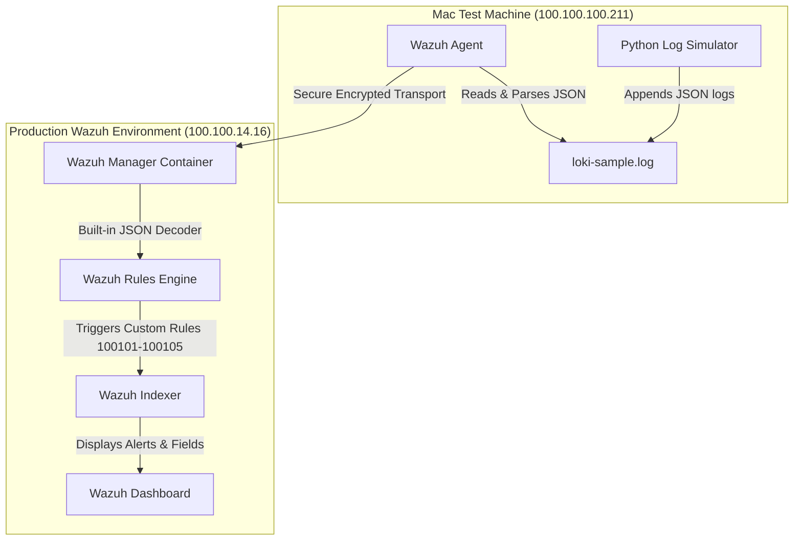

# Loki + Wazuh SIEM Integration Testing using JSON Logs

This repository contains the architecture, log generator, and configuration templates for a Proof of Concept (POC) evaluating if Loki Logs which are build using custom identified such as Hostname/device Name and Device IP (of VMs, Routers, Switches, Apps) are being able to sent to **Wazuh** as both a Security Information and Event Management (SIEM) system for JSON application and network logs.

---

## 1. Project Architecture

This POC demonstrates how structured JSON logs generated by application containers and network devices can be collected, decoded, indexed, and alerted upon without deploying Grafana Loki or modifying your core production infrastructure.
1. Mac Test Laptop/Machine hosting Python Generator Script for generating Test logs.
2. Mac Test Laptop installed and Enrolled with Wazuh Agent for sending logs into Wazuh Manager
3. Wazuh Server (Manager) installed with Custom Wazuh Rules Engine which decodes the JSON logs and display on UI. 



---

## 2. Repository Components

* **`loki-simulator/`**: The log generation engine.
  * `scripts/loki_sample_generator.py`: Generates structured JSON events simulating container apps (`grafana-loki`) and network gateways (`router-gateway`).
* **`wazuh-configs/`**: Wazuh configuration templates.
  * `agent-ossec-snippet.conf`: Configuration snippet for `/Library/Ossec/etc/ossec.conf` to parse the logs as JSON.
  * `manager-local-rules.xml`: Custom Wazuh rules to decode logs and trigger high-severity alerts.

---

## 3. Log JSON Schema

The generator writes flat JSON structures containing the following fields:

```json
{
  "timestamp": "2026-07-19T06:49:42.432189Z",
  "level": "CRITICAL",
  "app": "router-gateway",
  "hostname": "router-core-01.prod",
  "device_name": "router-core-01.prod",
  "source_ip": "10.0.1.1",
  "unique_id": "LOKI_ROUTER_router-core-01.prod_00001",
  "tenant": "production",
  "device_type": "router",
  "message": "High CPU utilization (95%) detected on Route Processor"
}
```

* **`hostname` / `device_name`**: The origin name of the container or router device. `device_name` is used specifically in Wazuh rule descriptions to prevent system conflicts with the Wazuh Agent header.
* **`source_ip`**: The IP address of the origin device.
* **`app`**: The application/service name.
* **`message`**: The human-readable event message.

---

## 4. Setup and Configuration

### A. Wazuh Agent Installation on Mac Laptop
1. Download the Wazuh macOS Agent installer package (`.pkg`) from the official Wazuh downloads page.
2. Enroll and install the agent via the terminal on your Mac. Set the enrollment environment variables before starting the installation:
   ```bash
   sudo WA_MANAGER="100.100.14.16" WA_AGENT_NAME="MAC-LOKI-POC-LUV" installer -pkg wazuh-agent-*.pkg -target /
   ```
3. Start the Wazuh Agent daemon:
   ```bash
   sudo /Library/Ossec/bin/wazuh-control start
   ```

### B. Python Log Simulator Setup & Deployment
1. Create the required directories on your Mac laptop:
   ```bash
   mkdir -p /Users/luvahuja/loki-testing/loki-simulator/{scripts,logs}
   ```
2. Write the log generator script to `/Users/luvahuja/loki-testing/loki-simulator/scripts/loki_sample_generator.py` (or clone/copy the script included in this repository).
3. Test a single run to generate the first batch of 20 logs:
   ```bash
   python3 /Users/luvahuja/loki-testing/loki-simulator/scripts/loki_sample_generator.py
   ```
    luvahuja@Luvs-MacBook-Air logstash % python3 /Users/luvahuja/loki-testing/loki-simulator/scripts/loki_sample_generator.py
                                         20 Loki/Router sample logs generated successfully with device_name.
   
### C. Configure Log Collection on Mac Agent
1. Open the agent configuration file on your Mac:
   ```bash
   sudo nano /Library/Ossec/etc/ossec.conf
   ```
2. Add the following block to scan the loki-sample log file:
   ```xml
   <localfile>
     <log_format>json</log_format>
     <location>/Users/luvahuja/loki-testing/loki-simulator/logs/loki-sample.log</location>
   </localfile>
   ```
3. Restart the Wazuh Agent:
   ```bash
   sudo /Library/Ossec/bin/wazuh-control restart
   ```

### D. Configure Custom Rules on Wazuh Manager
1. Create your local rules file on the Wazuh production server host machine at `/home/luv.ahuja/local_rules.xml` (using the templates provided in `wazuh-configs/manager-local-rules.xml`).
2. Copy the file into the running Wazuh Manager Docker container:
   ```bash
   sudo docker cp /home/luv.ahuja/local_rules.xml single-node-wazuh.manager-1:/var/ossec/etc/rules/local_rules.xml
   ```
3. Restart the container:
   ```bash
   sudo docker restart single-node-wazuh.manager-1
   ```

---

## 5. End-to-End Validation Plan

1. **Start the simulation** on the Mac machine:
   ```bash
   python3 loki-simulator/scripts/loki_sample_generator.py
   ```
2. **Monitor the alerts in real-time** on the Wazuh Server:
   ```bash
   sudo docker exec -it single-node-wazuh.manager-1 tail -f /var/ossec/logs/alerts/alerts.json | grep -E "100101|100102|100103|100104|100105"
   ```
3. **Wazuh Dashboard Index Refresh**:
   * Navigate to **Stack Management** -> **Index Patterns** -> **`wazuh-alerts-*`**.
   * Click **Refresh field list** in the top right to make `data.device_name`, `data.app`, `data.level`, and `data.message` searchable.
4. **Discover Logs**:
   * Search for `data.app : "router-gateway"` or `data.device_type : "router"`.
   * Add custom fields as columns for structured analysis.
