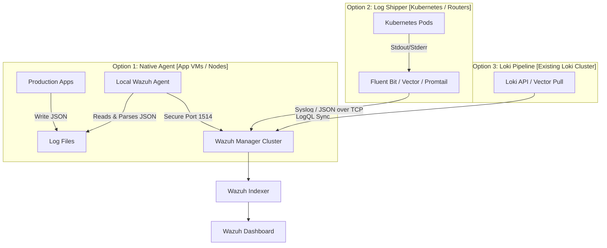

# Replicating the Wazuh + Loki Integration in Production

This guide outlines the architectural options and step-by-step implementation details to move your Proof of Concept (POC) into a production environment. It explains how to collect, ingest, and scale Loki-style JSON logs from production servers, Kubernetes clusters, and network devices.

---

## 1. Production Ingestion Architectures

Depending on your production topology, you can route logs using one of three primary options:



### Option 1: Decentralized Native Agents (Recommended for VMs/Bare Metal)
Deploy a Wazuh Agent on every production VM/node hosting your applications.

* **How it works**: The applications write JSON logs to a local directory. The local agent reads, parses the JSON, and securely ships them via AES-encrypted connection (Port 1514) to your manager.
* **Pros**: Native encryption, local log buffering if connection drops, FIM (File Integrity Monitoring), and zero additional software dependencies.
* **Cons**: Requires agent installation on every host (managed via Ansible/Puppet).

### Option 2: Log Forwarder / Syslog Gateway (Recommended for Kubernetes & Routers)
Use existing log collectors (such as Fluent Bit, Promtail, or Vector) to forward logs directly to the Wazuh Manager.

* **How it works**: 
  1. For Kubernetes: Fluent Bit reads pod logs and forwards them to a Wazuh Manager TCP/UDP port configured to receive syslog.
  2. For hardware routers: Routers send logs via standard syslog directly to the manager.
* **Pros**: No agent required on individual containers/routers.
* **Cons**: Does not support Wazuh agent-side buffering; requires open syslog ingress ports on the Wazuh Manager.

---

## 2. Replicating the Setup into Production (Step-by-Step)

### Step 2.1: Configure Wazuh Manager Cluster Rules
If your production Wazuh Manager runs in a cluster/multi-node configuration (with worker nodes), the custom rules must be synchronized across all manager nodes.

1. **Wazuh Cluster Daemon**: If using the Wazuh cluster, rules placed in `/var/ossec/etc/rules/local_rules.xml` on the Master node will automatically synchronize to all worker nodes.
2. Edit `/var/ossec/etc/rules/local_rules.xml` (or host mapping) on your **Master Manager Node** and add the custom rules block:
   ```xml
   <group name="loki,loki_app,">
     <rule id="100100" level="0">
       <decoded_as>json</decoded_as>
       <field name="app">grafana-loki|router-gateway</field>
       <description>Loki Integration: Loki-style JSON log ingested</description>
     </rule>
     <!-- Include rules 100101-100105 as verified in the POC -->
   </group>
   ```
3. Restart the Wazuh Manager cluster to apply rules.

---

### Step 2.2: Setup Production Log Collection

#### For Application VMs (Native Agent)
1. Automate Agent deployment via **Ansible** or **Puppet**.
2. Deploy the configuration block to `/var/ossec/etc/ossec.conf` on all production agents:
   ```xml
   <localfile>
     <log_format>json</log_format>
     <location>/var/log/apps/*-json.log</location>
   </localfile>
   ```
3. Ensure the directories are write-accessible to the application and readable by the `wazuh` user group.

#### For Kubernetes Clusters (Fluent Bit)
If you have a Kubernetes cluster running Fluent Bit, configure it to stream logs directly to the Wazuh Manager.

1. Configure the Wazuh Manager to listen on a secure TCP port (e.g. `5140`) for JSON logs. Add to the manager `ossec.conf`:
   ```xml
   <remote>
     <connection>syslog</connection>
     <port>5140</port>
     <protocol>tcp</protocol>
     <allowed-ips>10.100.0.0/16</allowed-ips> <!-- Pod CIDR -->
   </remote>
   ```
2. Configure the Fluent Bit output plugin to format and forward events:
   ```ini
   [OUTPUT]
       Name          tcp
       Match         kube.*
       Host          wazuh-manager.prod.internal
       Port          5140
       Format        json
   ```

---

## 3. Production Scaling & Performance Considerations

Ingesting high-volume application logs can put strain on your Wazuh Indexer and Manager storage. Apply these best practices to ensure stability:

### A. Log Rotation & Disk Space (Essential)
High-volume application logs will rapidly exhaust disk space if not rotated.
* Configure Linux `logrotate` on all application VM hosts:
  ```text
  /var/log/apps/*-json.log {
      daily
      rotate 7
      compress
      delaycompress
      missingok
      notifempty
      copytruncate
  }
  ```
  > [!IMPORTANT]
  > Using `copytruncate` is highly recommended for active log files so that applications do not lose file descriptors when rotation occurs.

### B. Index Sharding and Retention (Wazuh Indexer / OpenSearch)
JSON application logs generate many more index documents than OS security logs.
1. **Index State Management (ISM)**: Set up an ISM policy in OpenSearch to move index data to cold storage or delete it after a set period (e.g. roll over indices daily, delete after 30 days).
2. **Increase Shards**: If application log volume exceeds 50GB/day, configure the `wazuh-alerts-*` index template to use **2 shards** per index instead of the default 1 to distribute the indexing load across indexer cluster nodes.

### C. Rate Limiting (Flood Protection)
To prevent a single runaway application container from overwhelming the Wazuh Manager queue:
* Configure agent rate limits in `/var/ossec/etc/ossec.conf`:
  ```xml
  <client_buffer>
    <!-- Buffer size (messages) -->
    <size>100000</size>
    <!-- Maximum transmission rate (events per second) -->
    <eps>500</eps>
  </client_buffer>
  ```
